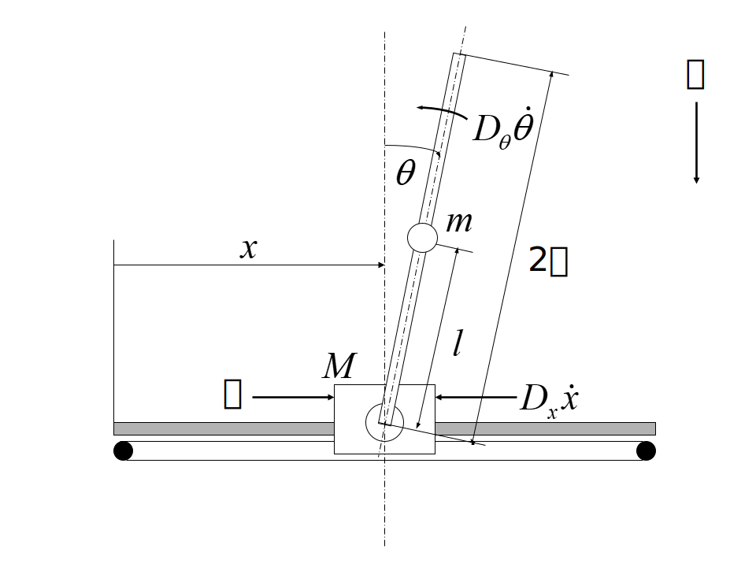
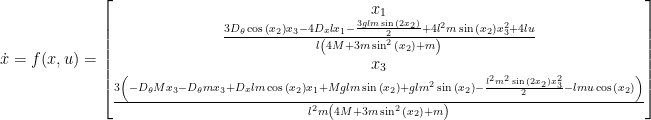
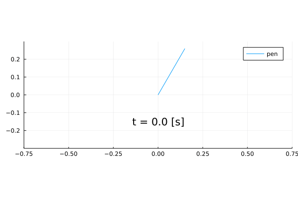

# 練習 : 倒立振子の制御

次の倒立振子の倒立制御シミュレーションを行う（B4輪講で使う[教科書](#1)のp.18にあるものです）． 

  

`x [m]` : 台車の位置  
`theta [rad]` : 振子の回転角  
`g [m/s^2]` : 重力加速度  
`2l [m]` : 振子の長さ  
`M [kg]` : 台車の質量  
`m [kg]` : 振子の質量  
`Dx [kg/s]` : 台車とレールの摩擦係数  
`Dtheta []` : 振子と台車の摩擦係数  
`u [N]` : 台車に加える入力  

## 要件
`theta`が0出ない初期値から倒立状態に復帰する制御を行う．  
観測できる状態変数は好きに決めて良い．  
質量や摩擦係数などのパラメータは好きに決めて良い.  

## 流れ
1. 状態方程式を導出  
* sympy等のシンボリック演算ツールを使って導出する．  
* `x = x1, v = x2, theta = x3, omega = x4`とおくとこんな状態方程式になります．  

* 手計算で出すのはかなり面倒です
2. 導出した状態方程式のシステムに対し制御器を設計する．  

3. 倒立制御シミュレーションを行う  

## 制御例
### PID
`theta`に対するPID制御を行ったシミュレーション例．  

### LQR
最適フィードバック制御（[教科書](#1)の第七章）で制御した例．  
 n

# 参考文献
<a name="1">小郷寛，美多勉，"システム制御理論入門"，実教出版株式会社，1979年</a>