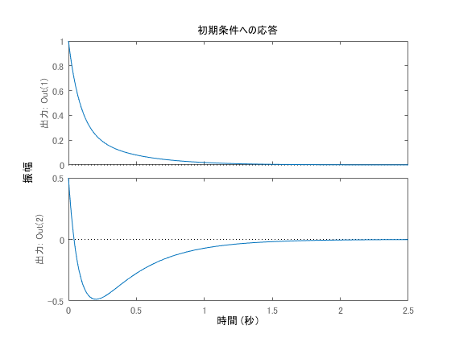

# ソルバを使って解く
まずはワークスペースを初期化  
```matlab
clear;
```  
線形時不変システムを定義する．  
```matlab
%% システム

x0 = [1, 0.5];

% システム
A = [
    1.1 2
    -0.3 -1
];
B = [
    1 2
    0.847 3
];
C = [
    1. 0.
    0. 1.
];

sys = ss(A, B, C, zeros(2, 2));
```
初期値応答を調べる．  
```matlab
%% 初期値応答
initial(sys, x0)
```
  
発散している．  

```icare()```を使ってリカッチ代数方程式を解く．  
公式ヘルプセンター : [https://jp.mathworks.com/help/control/ref/icare.html](https://jp.mathworks.com/help/control/ref/icare.html)

```matlab
%% リカッチ題数方程式を解く
Q = diag([10.0, 10.0]);  % 状態に関する重み行列
R = diag([1., 1.]);  % 入力に関する重み行列

S = [];
E = [];
G = [];

[P, K, L] = icare(A, B, Q, R, S, E, G);  %解く
```
`P`がリカッチ方程式の解，`K`が最適フィードバック行列である．  

```matlab
%% 最適レギュレータ
sys.A = sys.A -B*K;  % A行列を更新
initial(sys,x0)
```
  

安定化されている．  
